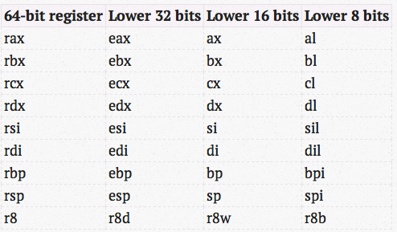

# bomb lab
Find 6 hidden keys with GDB.

I knew nothing about assembly language before this lab. 

<details> <summary>6 keys</summary>

```txt
Border relations with Canada have never been better.
1 2 4 8 16 32
1 311
1 0
ionefg
```

- *The key for phase 3 is not unique.*
- *The key for phase 4 is not unique.*
- *The key for phase 5 is not unique.*

</details>


## Phase 1
Check the code.

```c
input = read_line();
phase_1(input());
phase_defused();
```

Looks like the function `phase_1()` is the main part, do disassmbly to it.

<details><summary><code>disas phase_1</code></summary>

```assembly
(gdb) disas phase_1
Dump of assembler code for function phase_1:
   0x0000000000400ee0 <+0>:     sub    $0x8,%rsp
   0x0000000000400ee4 <+4>:     mov    $0x402400,%esi
   0x0000000000400ee9 <+9>:     call   0x401338 <strings_not_equal>
   0x0000000000400eee <+14>:    test   %eax,%eax
   0x0000000000400ef0 <+16>:    je     0x400ef7 <phase_1+23>
   0x0000000000400ef2 <+18>:    call   0x40143a <explode_bomb>
   0x0000000000400ef7 <+23>:    add    $0x8,%rsp
   0x0000000000400efb <+27>:    ret
End of assembler dump.
```

</details>

Function name `strings_not_equal` reminds us the key is a string.
The `test %eax,%eax` is `0` only if `%eax = 0`(`test` does logical and to its operands), which means the `strings_not_equal` function returns `0` i.e. strings are the same.

```bash
(gdb) x/s 0x402400
0x402400:   "Border relations with Canada have never been better."
```

This is the key. We are done.

## Phase 2

<details><summary><code>disas phase_2</code></summary>

```assembly
Dump of assembler code for function phase_2:
   0x0000000000400efc <+0>:     push   %rbp
   0x0000000000400efd <+1>:     push   %rbx
   0x0000000000400efe <+2>:     sub    $0x28,%rsp
   0x0000000000400f02 <+6>:     mov    %rsp,%rsi
   0x0000000000400f05 <+9>:     call   0x40145c <read_six_numbers>
   0x0000000000400f0a <+14>:    cmpl   $0x1,(%rsp)
   0x0000000000400f0e <+18>:    je     0x400f30 <phase_2+52>
   0x0000000000400f10 <+20>:    call   0x40143a <explode_bomb>
   0x0000000000400f15 <+25>:    jmp    0x400f30 <phase_2+52>
   0x0000000000400f17 <+27>:    mov    -0x4(%rbx),%eax
   0x0000000000400f1a <+30>:    add    %eax,%eax
   0x0000000000400f1c <+32>:    cmp    %eax,(%rbx)
   0x0000000000400f1e <+34>:    je     0x400f25 <phase_2+41>
   0x0000000000400f20 <+36>:    call   0x40143a <explode_bomb>
   0x0000000000400f25 <+41>:    add    $0x4,%rbx
   0x0000000000400f29 <+45>:    cmp    %rbp,%rbx
   0x0000000000400f2c <+48>:    jne    0x400f17 <phase_2+27>
   0x0000000000400f2e <+50>:    jmp    0x400f3c <phase_2+64>
   0x0000000000400f30 <+52>:    lea    0x4(%rsp),%rbx
   0x0000000000400f35 <+57>:    lea    0x18(%rsp),%rbp
   0x0000000000400f3a <+62>:    jmp    0x400f17 <phase_2+27>
   0x0000000000400f3c <+64>:    add    $0x28,%rsp
   0x0000000000400f40 <+68>:    pop    %rbx
   0x0000000000400f41 <+69>:    pop    %rbp
   0x0000000000400f42 <+70>:    ret
```

</details>

First, there are (most possibly) $6$ numbers according to the address `<+9>` -- function name.
Move eyes to address `<+14>`.
If the condition `1 == (%rsp)` is false, the bomb will explode.
So **the first number is** $1$.

Goto `<+52>`, assign `%rbx = arr + 1`, `%rbp = arr + 6`.
Goto `<+27>`, `%eax = 1`.
Goto `<+30>`, `%eax += %eax` $\Rightarrow$ `%eax = 2`.
Goto `<+32 - +36>`, we can infer that `%rbx == 2`, **which is the second number.**

Goto `<+41>`, `%rbx += 4` $\Rightarrow$ `%rbx = 8`.
Goto `<+45>`, not equal.
Goto `<+48>`, goto `<+27>`, `%eax = 4`.
Goto `<+30>`, `%eax = 8`.
Goto `<+41>`, `%rbx += 4` $\Rightarrow$ `%rbx = 12`.

......

Well the code actually shows a "running match".
Player `%rbx` runs $4$ miles an unit time if the other player `%eax` catches him.
While the player `%eax` keeps running double his miles every second.

The answer numbers are points the met before the match ends. Which is $1, 2, 4, 8, 16, 32$.

## Phase 3

<details><summary><code>disas phase_3</code></summary>

```assembly
Dump of assembler code for function phase_3:
   0x0000000000400f43 <+0>:	sub    $0x18,%rsp
   0x0000000000400f47 <+4>:	lea    0xc(%rsp),%rcx
   0x0000000000400f4c <+9>:	lea    0x8(%rsp),%rdx
   0x0000000000400f51 <+14>:	mov    $0x4025cf,%esi
   0x0000000000400f56 <+19>:	mov    $0x0,%eax
   0x0000000000400f5b <+24>:	call   0x400bf0 <__isoc99_sscanf@plt>
   0x0000000000400f60 <+29>:	cmp    $0x1,%eax
   0x0000000000400f63 <+32>:	jg     0x400f6a <phase_3+39>
   0x0000000000400f65 <+34>:	call   0x40143a <explode_bomb>
   0x0000000000400f6a <+39>:	cmpl   $0x7,0x8(%rsp)
   0x0000000000400f6f <+44>:	ja     0x400fad <phase_3+106>
   0x0000000000400f71 <+46>:	mov    0x8(%rsp),%eax
   0x0000000000400f75 <+50>:	jmp    *0x402470(,%rax,8)
   0x0000000000400f7c <+57>:	mov    $0xcf,%eax
   0x0000000000400f81 <+62>:	jmp    0x400fbe <phase_3+123>
   0x0000000000400f83 <+64>:	mov    $0x2c3,%eax
   0x0000000000400f88 <+69>:	jmp    0x400fbe <phase_3+123>
   0x0000000000400f8a <+71>:	mov    $0x100,%eax
   0x0000000000400f8f <+76>:	jmp    0x400fbe <phase_3+123>
   0x0000000000400f91 <+78>:	mov    $0x185,%eax
   0x0000000000400f96 <+83>:	jmp    0x400fbe <phase_3+123>
   0x0000000000400f98 <+85>:	mov    $0xce,%eax
   0x0000000000400f9d <+90>:	jmp    0x400fbe <phase_3+123>
   0x0000000000400f9f <+92>:	mov    $0x2aa,%eax
   0x0000000000400fa4 <+97>:	jmp    0x400fbe <phase_3+123>
   0x0000000000400fa6 <+99>:	mov    $0x147,%eax
   0x0000000000400fab <+104>:	jmp    0x400fbe <phase_3+123>
   0x0000000000400fad <+106>:	call   0x40143a <explode_bomb>
   0x0000000000400fb2 <+111>:	mov    $0x0,%eax
   0x0000000000400fb7 <+116>:	jmp    0x400fbe <phase_3+123>
   0x0000000000400fb9 <+118>:	mov    $0x137,%eax
   0x0000000000400fbe <+123>:	cmp    0xc(%rsp),%eax
   0x0000000000400fc2 <+127>:	je     0x400fc9 <phase_3+134>
   0x0000000000400fc4 <+129>:	call   0x40143a <explode_bomb>
   0x0000000000400fc9 <+134>:	add    $0x18,%rsp
   0x0000000000400fcd <+138>:	ret    
End of assembler dump.
```

</details>

Unluckily, there're no simple hints for the key.
What stops us is `<__isoc99_sscanf@plt>`.
Set a breakpoint here.

```bash
(gdb) b *(0x400f5b)
(gdb) disp/3i $pc
(gdb) r ./psol.txt

Breakpoint 1, 0x0000000000400f5b in phase_3 ()
1: x/3i $pc
=> 0x400f5b <phase_3+24>:       call   0x400bf0 <__isoc99_sscanf@plt>
   0x400f60 <phase_3+29>:       cmp    $0x1,%eax
   0x400f63 <phase_3+32>:       jg     0x400f6a <phase_3+39>
(gdb) stepi
0x0000000000400bf0 in __isoc99_sscanf@plt ()
1: x/3i $pc
=> 0x400bf0 <__isoc99_sscanf@plt>:      jmp    *0x202492(%rip)        # 0x603088 <__isoc99_sscanf@got.plt>
   0x400bf6 <__isoc99_sscanf@plt+6>:    push   $0x11
   0x400bfb <__isoc99_sscanf@plt+11>:   jmp    0x400ad0
(gdb)
__GI___isoc99_sscanf (s=0x603820 <input_strings+160> "1 311", format=0x4025cf "%d %d") at ./stdio-common/isoc99_sscanf.c:24
24      ./stdio-common/isoc99_sscanf.c: No such file or directory.
1: x/3i $pc
=> 0x7ffff7deb2d0 <__GI___isoc99_sscanf>:       endbr64
   0x7ffff7deb2d4 <__GI___isoc99_sscanf+4>:     push   %r13
   0x7ffff7deb2d6 <__GI___isoc99_sscanf+6>:     mov    %rdi,%r13
```

From the output, we know that one of the arguments of `scanf` is `"%d %d"` -- two integers.
(Actually in `<+14>`, the address `$0x4025cf` stores the string `"%d %d"`.)
Let's fill two numbers and continue.

```txt
114514 1919810
```

```bash
(gdb) finish
```

Goes to `<+29>`, here's a comparison between `1` and `%eax`.

```bash
(gdb) p $eax
$2 = 2
```

Goes to `<+39>`, comparison between `7` and `$rsp + 8`.

```bash
(gdb) p *(int*)($rsp + 8)
$3 = 114514
```

It's the first number I filled in. Since $114514 > 7$, it will go to `<+44>` $\rightarrow$ `<+106>` and explodes.
Remind that `ja` is comparison between unsigned numbers.
**The first number is ranged in** $[0, 7]$.

Coincidentally, below are $8$ pairs of `mov %eax` with `jmp`.
They all go to `<+123>` -- another `cmp`.

```bash
(gdb) p *(int*)($rsp + 0xc)
$4 = 1919810
```

Maybe the $8$ `mov` above are the answers respectively.
But where would they jump?
Goes to `<+50>`.
Set a breakpoint here.

Edit the answer file.

```txt
0 1919810
```

```bash
(gdb) b *0x400f75
(gdb) r ./psol.txt
(gdb) disp/3i $pc
(gdb) stepi
0x0000000000400f7c in phase_3 ()
1: x/3i $pc
=> 0x400f7c <phase_3+57>:       mov    $0xcf,%eax
   0x400f81 <phase_3+62>:       jmp    0x400fbe <phase_3+123>
   0x400f83 <phase_3+64>:       mov    $0x2c3,%eax
```

Modify the first number, you may jump to different address -- it's not hard to get answers.
Anyway, the answers are:

| the first num. | the second |
| -- | -- |
| 0 | 207 |
| 1 | 311 |
| 2 | 707 |
| 3 | 256 |
| 4 | 389 |
| 5 | 206 |
| 6 | 682 |
| 7 | 327 |

## Phase 4

<details><summary><code>disas phase_4</code></summary>

```assembly
Dump of assembler code for function phase_4:
   0x000000000040100c <+0>:     sub    $0x18,%rsp
   0x0000000000401010 <+4>:     lea    0xc(%rsp),%rcx
   0x0000000000401015 <+9>:     lea    0x8(%rsp),%rdx
   0x000000000040101a <+14>:    mov    $0x4025cf,%esi
   0x000000000040101f <+19>:    mov    $0x0,%eax
   0x0000000000401024 <+24>:    call   0x400bf0 <__isoc99_sscanf@plt>
   0x0000000000401029 <+29>:    cmp    $0x2,%eax
   0x000000000040102c <+32>:    jne    0x401035 <phase_4+41>
   0x000000000040102e <+34>:    cmpl   $0xe,0x8(%rsp)
   0x0000000000401033 <+39>:    jbe    0x40103a <phase_4+46>
   0x0000000000401035 <+41>:    call   0x40143a <explode_bomb>
   0x000000000040103a <+46>:    mov    $0xe,%edx
   0x000000000040103f <+51>:    mov    $0x0,%esi
   0x0000000000401044 <+56>:    mov    0x8(%rsp),%edi
   0x0000000000401048 <+60>:    call   0x400fce <func4>
   0x000000000040104d <+65>:    test   %eax,%eax
   0x000000000040104f <+67>:    jne    0x401058 <phase_4+76>
   0x0000000000401051 <+69>:    cmpl   $0x0,0xc(%rsp)
   0x0000000000401056 <+74>:    je     0x40105d <phase_4+81>
   0x0000000000401058 <+76>:    call   0x40143a <explode_bomb>
   0x000000000040105d <+81>:    add    $0x18,%rsp
   0x0000000000401061 <+85>:    ret
End of assembler dump.
```

</details>

The key is, with the method mentioned in phase 3, still a pair of integers.
Similarly, we can infer that the first numbers is in the range $[0, 14]$.
Moreover, there's an important hint in `<+69>` -- **the second number is** $0$.
~~We indeed can just enumerate 15 possible answers~~

Anyway, `call <func4>` finally returns `0`.
Diving into `<func4>`, you'll get codes below.

<details><summary><code>disas func4</code></summary>

```assembly
Dump of assembler code for function func4:
  0x0000000000400fce <+0>:     sub    $0x8,%rsp
  0x0000000000400fd2 <+4>:     mov    %edx,%eax
  0x0000000000400fd4 <+6>:     sub    %esi,%eax
  0x0000000000400fd6 <+8>:     mov    %eax,%ecx
  0x0000000000400fd8 <+10>:    shr    $0x1f,%ecx
  0x0000000000400fdb <+13>:    add    %ecx,%eax
  0x0000000000400fdd <+15>:    sar    %eax
  0x0000000000400fdf <+17>:    lea    (%rax,%rsi,1),%ecx
  0x0000000000400fe2 <+20>:    cmp    %edi,%ecx
  0x0000000000400fe4 <+22>:    jle    0x400ff2 <func4+36>
  0x0000000000400fe6 <+24>:    lea    -0x1(%rcx),%edx
  0x0000000000400fe9 <+27>:    call   0x400fce <func4>
  0x0000000000400fee <+32>:    add    %eax,%eax
  0x0000000000400ff0 <+34>:    jmp    0x401007 <func4+57>
  0x0000000000400ff2 <+36>:    mov    $0x0,%eax
  0x0000000000400ff7 <+41>:    cmp    %edi,%ecx
  0x0000000000400ff9 <+43>:    jge    0x401007 <func4+57>
  0x0000000000400ffb <+45>:    lea    0x1(%rcx),%esi
  0x0000000000400ffe <+48>:    call   0x400fce <func4>
  0x0000000000401003 <+53>:    lea    0x1(%rax,%rax,1),%eax
  0x0000000000401007 <+57>:    add    $0x8,%rsp
  0x000000000040100b <+61>:    ret
End of assembler dump.
```

</details>

It's recursive, which really upset me a lot.
Before read it, I learnt some assembly.

 - `%eax` always stores the return value of functions.
 - The parameters of functions are sotred in `%rdi`, `%rsi`, `%rdx`, `%rcx`, `%r8` and `%r9`.




`%rdi`, `%rsi` and `%rdx` have been used in `<phase_4>`.
Let what we input are `x y`, then the registers:

| register | variable |
| -- | -- |
| `%rdi` | `x` |
| `%rsi` | `0` |
| `%rdx` | `14` (`0XE`) |

All of them appear in `<func4>`. Thus we can infer `<func4>` has `3` parameters.
Let them be `x, l, r`.

Check `<phase_4>:<+65>`, here's a return value `%eax`.
Thus we guess the `<func4>` is like:

```cpp
int func4(int x, int l, int r);
```

Where the `l, r` = `0, 14` at first.

Above `<func4>:<+17>`, it's simply(indeed there'are more details but no need to care):

```cpp
int foo = (r - l) / 2 + l;
```

Which is almost (if not overflow):

```cpp
int foo = (l + r) / 2;
```

Below are the recursion:

```cpp
if (foo < x) {
  return 2 * func4(x, l, foo - 1);
} else if (foo > x) {
  return 2 * func4(x, foo + 1, r) + 1;
} else {
  return 0;
}
```

We can calculate the result with `x` ranged in `[0, 14]`:

| 0 | 1 | 2 | 3 | 4 | 5 | 6 | 7 | 8 | 9 | 10 | 11 | 12 | 13 | 14 |
| -- | -- | -- | -- | -- | -- | -- | -- | -- | -- | -- | -- | -- | -- | -- |
| 0 | 0 | 4 | 0 | 2 | 2 | 6 | 0 | 1 | 1 | 5 | 1 | 3 | 3 | 7 |

So `x` can be `0, 1, 4, 7`.

## Phase 5

<details><summary><code>disas phase_5</code></summary>

```assembly
Dump of assembler code for function phase_5:
  0x0000000000401062 <+0>:     push   %rbx
  0x0000000000401063 <+1>:     sub    $0x20,%rsp
  0x0000000000401067 <+5>:     mov    %rdi,%rbx
  0x000000000040106a <+8>:     mov    %fs:0x28,%rax
  0x0000000000401073 <+17>:    mov    %rax,0x18(%rsp)
  0x0000000000401078 <+22>:    xor    %eax,%eax
  0x000000000040107a <+24>:    call   0x40131b <string_length>
  0x000000000040107f <+29>:    cmp    $0x6,%eax
  0x0000000000401082 <+32>:    je     0x4010d2 <phase_5+112>
  0x0000000000401084 <+34>:    call   0x40143a <explode_bomb>
  0x0000000000401089 <+39>:    jmp    0x4010d2 <phase_5+112>
  0x000000000040108b <+41>:    movzbl (%rbx,%rax,1),%ecx
  0x000000000040108f <+45>:    mov    %cl,(%rsp)
  0x0000000000401092 <+48>:    mov    (%rsp),%rdx
  0x0000000000401096 <+52>:    and    $0xf,%edx
  0x0000000000401099 <+55>:    movzbl 0x4024b0(%rdx),%edx
  0x00000000004010a0 <+62>:    mov    %dl,0x10(%rsp,%rax,1)
  0x00000000004010a4 <+66>:    add    $0x1,%rax
  0x00000000004010a8 <+70>:    cmp    $0x6,%rax
  0x00000000004010ac <+74>:    jne    0x40108b <phase_5+41>
  0x00000000004010ae <+76>:    movb   $0x0,0x16(%rsp)
  0x00000000004010b3 <+81>:    mov    $0x40245e,%esi
  0x00000000004010b8 <+86>:    lea    0x10(%rsp),%rdi
  0x00000000004010bd <+91>:    call   0x401338 <strings_not_equal>
  0x00000000004010c2 <+96>:    test   %eax,%eax
  0x00000000004010c4 <+98>:    je     0x4010d9 <phase_5+119>
  0x00000000004010c6 <+100>:   call   0x40143a <explode_bomb>
  0x00000000004010cb <+105>:   nopl   0x0(%rax,%rax,1)
  0x00000000004010d0 <+110>:   jmp    0x4010d9 <phase_5+119>
  0x00000000004010d2 <+112>:   mov    $0x0,%eax
  0x00000000004010d7 <+117>:   jmp    0x40108b <phase_5+41>
  0x00000000004010d9 <+119>:   mov    0x18(%rsp),%rax
  0x00000000004010de <+124>:   xor    %fs:0x28,%rax
  0x00000000004010e7 <+133>:   je     0x4010ee <phase_5+140>
  0x00000000004010e9 <+135>:   call   0x400b30 <__stack_chk_fail@plt>
  0x00000000004010e9 <+140>:   add    $0x20,%rsp
  0x00000000004010e9 <+144>:   pop    %rbx
  0x00000000004010e9 <+145>:   ret
End of assembler dump.
```

</details>

`<+29>`: looks like that we need a string consisting of `6` characters.
`<+112>`: `%eax = 0`.
`<+41>`: convert **B**yte to **L**ong, `ecx = (Long)rbx + rax` i.e. `ecx = (Long)rbx`.

If you examine what stores in `%rbx`, you'll see the string you input.

`<+45>, <+48>, <+52>`: `edx = cl & 0XF`.
`<+55>`: check the string in `0x4024b0`:

```shell
(gdb) x/s 0x4024b0
0x4024b0 <array.3449>:  "maduiersnfotvbylSo you think you can stop the bomb with ctrl-c, do you?"
```

The expression is equivalent to assign a character to `%edx`.
Then `<+62>`: store `(rsp + rax * 1 + 0x10)` by `%dl`.

Below shows a loop.

```assembly
0x00000000004010a4 <+66>:    add    $0x1,%rax
0x00000000004010a8 <+70>:    cmp    $0x6,%rax
0x00000000004010ac <+74>:    jne    0x40108b <phase_5+41>
```

`<+81>`: check the address:

```shell
(gdb) x/s 0x40245e
0x40245e:       "flyers"
```

`<+86>`: `$rdi = rsp + 0x10` -- what the string like is based what we input.
Anyway, we need the indexes:

```txt
-0123456789012345----invalid after
"maduiersnfotvbylSo you think you can stop the bomb with ctrl-c, do you?"
------xxx-x----xx----
```

The sequence is `[9, 15, 14, 5, 6, 7]`.
All we need to find is, what string will got this with its each character do logical and with `0XF`?

Wlog what we input are lower cases.
The range is `[97, 122]` -- `[0x61, 0x7a]`.

So the answer is, `[0x69,0x6f, 0x6e, 0x65, 0x66, 0x67]` -- `"ionefg"`.
What's interesting is that, `I` is `0X49` -- which means the answer could be `"IONEFG"` (or mixed-case) too.
